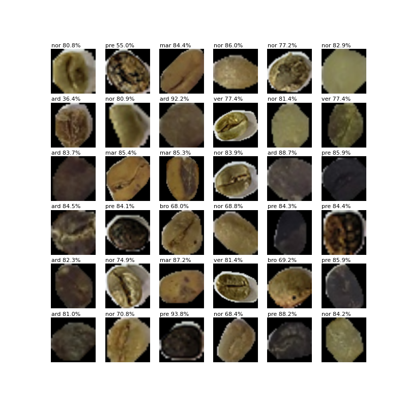
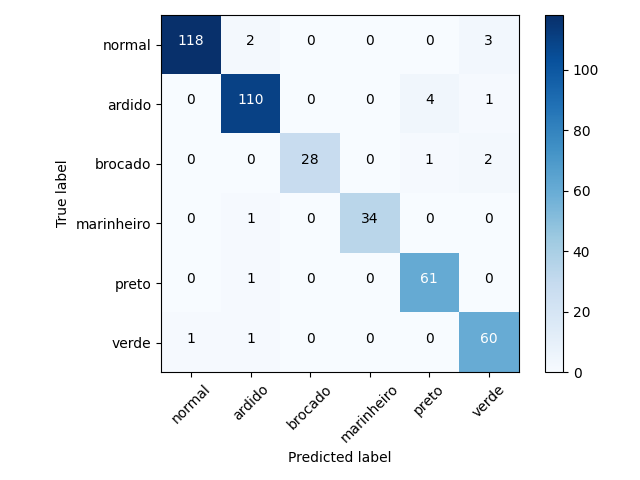

# Classificação de grãos de café arábica

[](https://www.python.org/downloads/)
[](https://www.tensorflow.org/)
[](https://github.com/wbmagalhaes/coffee-classification/actions)
[](https://github.com/wbmagalhaes/coffee-classification/issues)

<p align="center">
  Rede neural para classificação de defeitos em grãos crus de café arábica.
  
</p>

Desenvolvida por William Bernardes Magalhães como parte do projeto de Mestrado para obtenção do título de Mestre em Química pela Universidade Estadual de Londrina.

# Tabela de Conteúdos

- [Classificação de grãos de café arábica](#classificação-de-grãos-de-café-arábica)
- [Tabela de Conteúdos](#tabela-de-conteúdos)
- [Requisitos](#requisitos)
- [Uso](#uso)
	- [Classificar TFRecords](#classificar-tfrecords)
		- [Parâmetros](#parâmetros)
		- [Formato do Resultado](#formato-do-resultado)
	- [Classificar Imagens](#classificar-imagens)
	- [Parâmetros](#parâmetros-1)
		- [Formato do Resultado](#formato-do-resultado-1)
- [Cite Este Projeto](#cite-este-projeto)

# Requisitos

- Python 3.8
- Tensorflow 2.4.1

# Uso

Existem duas formas de realizar a classificação, utilizando o formato [TFRecord](https://www.tensorflow.org/tutorials/load_data/tfrecord) ou utilizando imagens no formato JPG.

Para utilizar o TFRecord, as imagens já devem ter sido segmentadas e os grãos devem ter classificação conhecida. O TFRecord do dataset de testes pode ser utilizado como exemplo. Detalhes de como gerar TFRecords a partir de seus dados podem ser encontrados em [Criar TFRecords](docs/training.md#criar-tfrecords).

Para classificar imagens diretamente, eles devem estar no formato JPG. Se uma segmentação para imagem não for encontrada, a imagem é segmentada pelo algoritmo Otsu.

Uma rede de exemplo treinada com imagens de grãos de café arábica pode ser encontrada no diretório [models/saved_models](models/saved_models), mas você pode treinar uma nova rede utilizando seus dados. A documentação para o treinamento de uma rede pode ser encontrada em [Treinamento](docs/training.md#treinamento).

## Classificar TFRecords

No TFRecord, os grãos estão recortados da imagem e a classificação já é conhecida. Esse método é utilizado para comparar a classificação esperada e a classificação obtida

```
python classify_tfrecords.py
```

### Parâmetros

| **Parâmetro** |           **Padrão**           | **Descrição**                |
| :------------ | :----------------------------: | :--------------------------- |
| -i --inputdir |  data/teste_dataset.tfrecord   | caminho até o TFRecord       |
| -m --modeldir | models/saved_models/CoffeeNet6 | diretório contendo o modelo  |
| --im_size     |               64               | tamanho das imagens de input |
| --batch       |               36               | número de imagens por batch  |

**Parâmetro -i**

Define o caminho até o arquivo TFRecord que será classificado.

**Parâmetro -m**

Define o diretório onde está o modelo no formato Saved Model.

**Parâmetro --im_size**

Tamanho do lado da imagem que está salva no TFRecord.

O formato da imagem será quadrado, com 3 canais RGB (--im_size, --im_size, 3).

**Parâmetro --batch**

Define o tamanho da batch de imagens que será passada à rede em cada step da classificação.

### Formato do Resultado

Após a classificação, são mostradas algumas das imagens que foram classificadas e a matriz de confusão da rede.





```
              precision    recall  f1-score   support

           0       0.99      0.96      0.98       123
           1       0.96      0.96      0.96       115
           2       1.00      0.90      0.95        31
           3       1.00      0.97      0.99        35
           4       0.92      0.98      0.95        62
           5       0.91      0.97      0.94        62

    accuracy                           0.96       428
   macro avg       0.96      0.96      0.96       428
weighted avg       0.96      0.96      0.96       428
```

## Classificar Imagens

Pode classificar diretamente qualquer imagem JPG. Os grãos são recortados da imagem utilizando o arquivo de segmentação e classificados.

```
python classify_images.py
```

## Parâmetros

| **Parâmetro** |           **Padrão**           | **Descrição**                    |
| :------------ | :----------------------------: | :------------------------------- |
| -i --inputdir |  data/teste_dataset.tfrecord   | caminho até o TFRecords          |
| -m --modeldir | models/saved_models/CoffeeNet6 | diretório contendo o modelo      |
| --im_size     |               64               | tamanho das imagens de input     |
| --ignore      |             False              | ignora segmentação pré-existente |

**Parâmetro -i**

Define o caminho até o arquivo TFRecord que será classificado.

**Parâmetro -m**

Define o diretório onde está o modelo no formato Saved Model.

**Parâmetro --im_size**

Tamanho do lado da imagem que é esperado pela rede.

O formato da imagem será um quadrado com 3 canais RGB, (--im_size, --im_size, 3).

**Parâmetro --ignore**

Caso este parâmetro esteja presente, ignora a segmentação pré-existente e faz uma nova segmentação.

### Formato do Resultado

Gera uma lista da quantidade de grão de cada classe em cada imagem classificada.

```
images\20200122_150244.jpg
normal 8
ardido 14
brocado 15
preto 3
verde 17

images\20200818_173334.jpg
normal 31
ardido 62
brocado 30
marinheiro 1
verde 20

images\20200818_173821.jpg
normal 39
ardido 41
brocado 25
preto 27
verde 35
```

# Cite Este Projeto

```
@misc{magalhaes2021,
  author =  {William Bernardes Magalh{\~a}es},
  title  =  {Classificação de defeitos em grãos de café arábica},
  url    =  {https://github.com/wbmagalhaes/coffee-classification},
  year   =  {2021}
}
```
