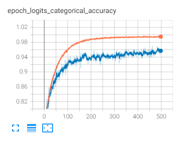

# Treinamento da Rede

Para o treinamento de um novo modelo, utilize o formato [TFRecord](https://www.tensorflow.org/tutorials/load_data/tfrecord), no diretório [data](data) você pode encontrar os TFRecords das imagens localizadas em [images](images).

# Tabela de Conteúdos

- [Treinamento da Rede](#treinamento-da-rede)
- [Tabela de Conteúdos](#tabela-de-conteúdos)
  - [Segmentar Imagens](#segmentar-imagens)
    - [Parâmetros](#parâmetros)
    - [Formato do Resultado](#formato-do-resultado)
  - [Criar TFRecords](#criar-tfrecords)
    - [Parâmetros](#parâmetros-1)
    - [Formato do Resultado](#formato-do-resultado-1)
  - [Ver TFRecords](#ver-tfrecords)
    - [Parâmetros](#parâmetros-2)
    - [Formato do Resultado](#formato-do-resultado-2)
  - [Treinamento](#treinamento)
    - [Parâmetros](#parâmetros-3)
    - [Formato do Resultado](#formato-do-resultado-3)
  - [Export to .lite](#export-to-lite)
    - [Parâmetros](#parâmetros-4)
    - [Formato do Resultado](#formato-do-resultado-4)
  - [Export to Saved Model](#export-to-saved-model)
    - [Parâmetros](#parâmetros-5)
    - [Formato do Resultado](#formato-do-resultado-5)

## Segmentar Imagens

Segmentar e gerar os .json

```
python segment_images.py
```

### Parâmetros

| **Parâmetro**  | **Padrão** | **Descrição**                            |
| :------------- | :--------: | :--------------------------------------- |
| -i --imagesdir |   images   | diretório contendo as imagens            |
| -o --outputdir |    None    | diretório onde serão criados os jsons    |
| --ignore       |   False    | ignora segmentação pré-existente         |
| --overwrite    |   False    | sobreescreve a segmentação pré-existente |

**Parâmetro -i**

Define o diretório onde estão as imagens para segmentação.

**Parâmetro -o**

Define o diretório onde serão salvas as segmentações.

**Parâmetro --ignore**

Se presente, ignora a segmentação pré-existente e cria uma nova.

**Parâmetro --overwrite**

Se presente, sobreescreve o arquivo de segmentação pre-existente.

### Formato do Resultado

Os arquivos contendo a segmentação são criados no mesmo diretório das imagens, ou no diretório definido.

```
[
  {
    "label": "não classificado",
    "points": [
      [156, 640],
      [155, 647],
      [151, 653],
      [145, 656],
      [137, 657],
      [132, 643],
      [134, 636]
    ]
  },
  {
    "label": "não classificado",
    "points": [
      [189, 641],
      [188, 644],
      [183, 649],
      [181, 650],
      [178, 651],
      [161, 640],
      [159, 637],
      [159, 631],
      [167, 623]
    ]
  }
]
```

## Criar TFRecords

Você pode criar TFRecords para o treinamento a partir suas próprias imagens.

```
python create_tfrecords.py
```

### Parâmetros

| **Parâmetro**   | **Padrão** | **Descrição**                                       |
| :-------------- | :--------: | :-------------------------------------------------- |
| -i --inputdir   |   images   | diretório contendo as imagens e a segmentação       |
| -o --outputdir  |    data    | diretório onde serão criados os tfrecords           |
| --im_size       |     64     | tamanho final da imagem recortada do grão           |
| --train_percent |    0.8     | porcentagem de imagens para treinamento             |
| --no-shuffle    |    True    | não randomiza as imagens antes de dividir o dataset |

**Parâmetro -i**

Define o diretório onde são as imagens do dataset de grãos.

As imagens devem estar no formato JPG, podendo estar separadas em subspastas. Os arquivos de segmentação devem estar na mesma pasta e ter o mesmo nome da imagem correspondente.

**Parâmetro -o**

Define o diretório onde serão criados os arquivos .tfrecord usados pela rede.

Os arquivos são criados com os nomes train_dataset.tfrecord, valid_dataset.tfrecord e teste_dataset.tfrecord. Arquivos de mesmo nome serão substituídos.

**Parâmetro --im_size**

Define o redimensionamento do recorte quadrado do grão de café.

**Parâmetro --train_percent**

Define a porcentagem de imagens que serão utilizadas no treinamento, a porcentagem restante é dividida igualmente entre validação e teste. O valor padrão de 0.8 corresponde a 80%.

**Parâmetro --no-shuffle**

Por padrão, as imagens são randomizadas antes da divisão em treinamento, validação e teste. Se este parâmetro estiver presente, as imagens não são randomizadas.

### Formato do Resultado

```
4275 total images
normal: 1149
ardido: 1139
brocado: 404
marinheiro: 307
preto: 615
verde: 661

3420 train images
normal: 912
ardido: 910
brocado: 334
marinheiro: 241
preto: 500
verde: 523

427 valid images
normal: 114
ardido: 114
brocado: 39
marinheiro: 31
preto: 53
verde: 76

428 teste images
normal: 123
ardido: 115
brocado: 31
marinheiro: 35
preto: 62
verde: 62
```

Após carregar as imagens e gerar os TFRecords, será mostrado uma lista contendo a quantidade de imagens de cada classe separadas nos datasets de treinamento, validação e teste.

## Ver TFRecords

Para verificar as imagens armazenadas nos TFRecords.

```
python show_tfrecords.py
```

### Parâmetros

| **Parâmetro** |         **Padrão**          | **Descrição**                   |
| :------------ | :-------------------------: | :------------------------------ |
| -p --path     | data/valid_dataset.tfrecord | caminho para o arquivo TFRecord |
| --batch       |             36              | quantidades de imagens          |
| --augment     |            False            | aplica augmentation nas imagens |

**Parâmetro -p**

Define o path para o arquivo TFRecord contendo as imagens que se deseja visualizar.

**Parâmetro --batch**

Define o número de imagens que serão mostradas. Sugiro no máximo 64 imagens.

**Parâmetro --augment**

Caso este parâmetro esteja presente, aplica o data augmentation, rotações e espelhamento nas imagens e mostra o resultado.

### Formato do Resultado


Mostra o primeiro batch de imagens no arquivo TFRecords com o nome de suas respectivas classes.

## Treinamento

A rede é treinada usando a biblioteca TensorFlow 2.4.1 utilizando a pipeline TFRecords.

```
python training.py
```

### Parâmetros

| **Parâmetro**    |         **Padrão**          | **Descrição**                                    |
| :--------------- | :-------------------------: | :----------------------------------------------- |
| -t --train       | data/train_dataset.tfrecord | caminho para o arquivo TFRecord de treinamento   |
| -v --valid       | data/valid_dataset.tfrecord | caminho para o arquivo TFRecord de validação     |
| --output         | models/h5_models/CoffeeNet6 | diretório onde o modelo é salvo                  |
| --logdir         |       logs/CoffeeNet6       | diretório onde os logs de treinamento são salvos |
| --batch          |             64              | tamanho do batch de imagens                      |
| --epochs         |             500             | quantidade de epochs de treinamento              |
| --im_size        |             64              | tamanho das imagens de input                     |
| --nlayers        |              5              | número de camadas de extração                    |
| --filters        |             64              | quantidade de filtros da primeira camada         |
| --kernelinit     |          he_normal          | método de inicialização dos weigths              |
| --l2             |            0.01             | valor do beta da regularização L2                |
| --biasinit       |             0.1             | valor de inicialização dos biases                |
| --lrelualpha     |            0.02             | valor do alpha da ativação LeakyReLU             |
| --outactivation  |           softmax           | ativação da última camada da rede                |
| --lr             |            1e-4             | learning rate do otimizador Adam                 |
| --labelsmoothing |             0.2             | suavização aplicada no vetor onehot              |

**Parâmetro -t**

Define o caminho para o arquivo TFRecords contendo o dataset de treinamento.

**Parâmetro -v**

Define o caminho para o arquivo TFRecords contendo o dataset de validação.

**Parâmetro -output**

Define o diretório onde será salvo o modelo.

**Parâmetro -logdir**

Define o diretório onde serão salvos os logs de treinamento para visualização no TensorBoard.

**Parâmetro --batch**

Define o tamanho da batch de imagens que será passada à rede em cada step do treinamento.

**Parâmetro --epochs**

Define o número de epochs de treinamento. A quantidade de steps por epoch é calculada automaticamente.

**Parâmetro --im_size**

Define o tamanho do lado da imagem que está salva no TFRecord. O formato da imagem será um quadrado com 3 canais RGB, (--im_size, --im_size, 3).

**Parâmetro --nlayers**

Define a quantidade de camadas de convolução extratoras.

**Parâmetro --filters**

Define o número de filtros na primeira camada. Após a primeira camada, a quantidade de filtros sempre dobra.

**Parâmetro --kernelinit**

Define o tipo de inicialização dos weights.

**Parâmetro --l2**

Define o valor do fator de regularização L2.

**Parâmetro --biasinit**

Define o valor inicial dos biases.

**Parâmetro --lrelualpha**

Define o valor do alfa da ativação LeakyReLU entre as camadas de convolução.

**Parâmetro --outactivation**

Define o tipo de ativação da última camada.

**Parâmetro --lr**

Define o learning rate do otimizador Adam.

**Parâmetro --labelsmoothing**

Define o valor da suavização do vetor one hot encoded.

### Formato do Resultado

```
Epoch 1/10
182/182 [==============] - 16s 66ms/step - loss: 40.8213 - logits_loss: 1.4470 - logits_categorical_accuracy: 0.5326 - val_loss: 39.7749 - val_logits_loss: 1.6034 - val_logits_categorical_accuracy: 0.3621
Epoch 2/10
182/182 [==============] - 12s 64ms/step - loss: 38.9904 - logits_loss: 1.2198 - logits_categorical_accuracy: 0.6886 - val_loss: 37.8582 - val_logits_loss: 1.2761 - val_logits_categorical_accuracy: 0.6549
Epoch 3/10
182/182 [==============] - 12s 64ms/step - loss: 37.3861 - logits_loss: 1.1897 - logits_categorical_accuracy: 0.7082 - val_loss: 36.2330 - val_logits_loss: 1.1736 - val_logits_categorical_accuracy: 0.7147
Epoch 4/10
131/182 [==========>---] - 12s 63ms/step - loss: 35.8461 - logits_loss: 1.1548 - logits_categorical_accuracy: 0.7258 - val_loss: 34.7300 - val_logits_loss: 1.1247 - val_logits_categorical_accuracy: 0.7717
```


## Export to .lite

```
python to_lite.py
```

### Parâmetros

| **Parâmetro** |              **Padrão**              | **Descrição**                              |
| :------------ | :----------------------------------: | :----------------------------------------- |
| --modeldir    |     models/h5_models/CoffeeNet6      | diretório contendo o arquivo .h5 do modelo |
| --epoch       |                 500                  | epoch que será salva                       |
| --output      | models/tflite_models/coffeenet6.lite | caminho onde sera salvo o arquivo          |

**Parâmetro --modeldir**

Define o diretório onde está o modelo no formato h5.

**Parâmetro --epoch**

Define qual época de modelo será carregada.

**Parâmetro --output**

Define o diretório onde será salvo o modelo no formato lite.

### Formato do Resultado

Gera o arquivo com o modelo no formato lite.

## Export to Saved Model

```
python to_saved_model.py
```

### Parâmetros

| **Parâmetro** |           **Padrão**           | **Descrição**                              |
| :------------ | :----------------------------: | :----------------------------------------- |
| --modeldir    |  models/h5_models/CoffeeNet6   | diretório contendo o arquivo .h5 do modelo |
| --epoch       |              500               | epoch que será salva                       |
| --output      | models/saved_models/CoffeeNet6 | diretório onde sera salvo o modelo         |

**Parâmetro --modeldir**

Define o diretório onde está o modelo no formato h5.

**Parâmetro --epoch**

Define qual época de modelo será carregada.

**Parâmetro --output**

Define o diretório onde será salvo o Saved Model.

### Formato do Resultado

Gera o arquivo com o modelo no formato Saved Model.
